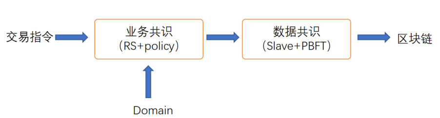
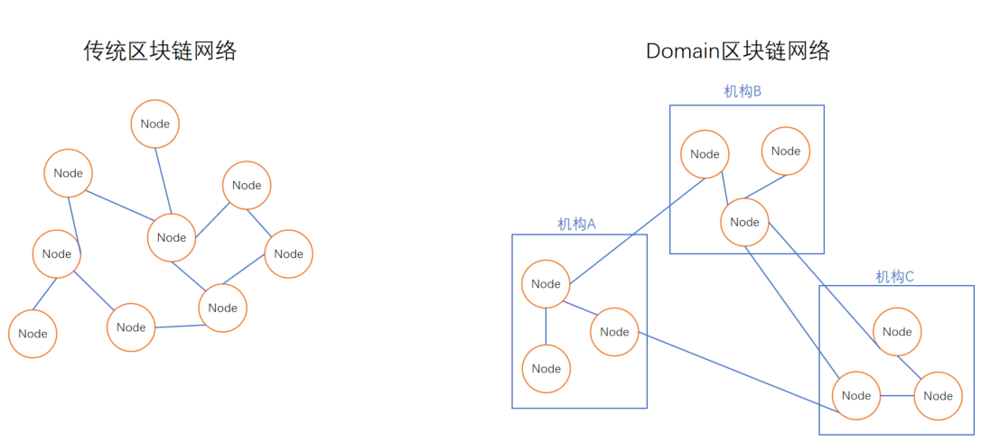

## Domain
### 什么是Domain?
+ STACS区块链具有双重共识架构的设计

Domain是位于业务共识层面的概念，它的主要作用是为机构建立“域”的概念，并将原来很多基于“节点”的业务逻辑迁移到“域”上

### 为什么需要Domain?
+ 区块链是以节点为基本单元的去中心化账本（不管是联盟链还是公有链）
1. 节点是共识的最小单元，不管是`POW`、`POS`还是基于`PBFT`的可信共识协议，都是以节点为基础的。拥有更多算力/权益/节点的机构，在区块链账本中拥有更大的投票权
2. 以节点为基础单元的去中心化账本，必然将导致“节点竞争”，`POW`的节点会争取自己有更多的算力，`POS`节点会争取自己有更多的`staking`，`PBFT`节点会争取自己有更多的节点数量。
3. 在公有链的情况下，节点竞争有利于维持公有链的整体生态和经济模型，公有链的记账和资产管理依靠去中心化的匿名节点之间的竞争来维护网络的安全性。
4. 在金融联盟链中，节点竞争是不必要的，机构间的分布式记账和清算，依靠金融机构的监管和合作的法律框架来进行。“节点越多权利越大”变成了一种技术错误。
### Domain如何工作?
金融区块链的共识权利应当成为一种在法律框架下的基于各个参与机构的可配置的方案，为此我们设计了基于`Domain`的业务共识方案，`Domain`的作用有两个：

+ `Domain` 代替`node`，成为金融区块链的业务共识单元。

+ 一个金融机构只维护一个`Domain`，STACS区块链的业务共识以`Domain`为单位进行。增加`Domain`内的`node`数量并不能为该`Domain`争取更大的投票权重。
+ 假设银行A、B和C共同维护了STACS Native区块链，分别拥有3个`Domain`，分别是`DomainA`、 `DomainB`和`DomainC`。银行A在`DomainA`内维护了10个节点，B在`DomainB`内只有2个节点，C的规模最小，只有1个节点，在传统的区块链中，A由于拥有超过全网80%的节点，将可以随意改变整个区块链的记账数据。但我们引入了`Domain`的概念之后，A/B/C在业务共识上是完全平等的，各自有1/3的权重（此权重可以根据业务需求配置），因此`节点竞争`已经被完全放弃

### 更多细节?

# RS