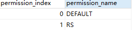

### 概述

+ 整个链我们对参与者进行了 身份的抽象，同时我们对于身份赋予了`Permission`【类似权限】，`Permission`可以更加细粒度的控制参与者参加业务的控制范围。当定制业务时需要制定参与各业务的权限，参与者必须具备交易要求的权限才能参与业务操作。

###  Permission定义

+ permission结构

  ​	 &nbsp;&nbsp;&nbsp;&nbsp;  permissionIndex：每个`permission`都对应一个`index`，且`index`为正整数，每添加一个`permission`，`index`会自动加`Permission`只可以添加不可以删除。

  ​	&nbsp;&nbsp;&nbsp;&nbsp;  permissionName：名称整个链不允许重复

  

+ 系统预留0-20个整数的`Permission`
  + DEFAULT （index为0）：`Idendity`默认的的`Permission`，如果定义的<u>BD</u>业务默认允许所有的Identity都可以参与业务，那么可以将permission设置为DEFAULT。
  + RS （index为0）:可以执行CRSFunction交易（具体参考<u>[BD]</u>交易）

+ 添加permission
  + 通过发送Permission注册交易添加新的permission，

### 用户Permission授权流程

+ 通过 <u>/permission/open/authorize</u> 接口给地址添加权限，接口参数
identityAddress：授权`Identity`地址
permissionNames：授权的`permission`集合，可同时授权多个`permission`
identityType：`Identity`类型1. user 2. domain 3. node

~~~
    {
    "permissionNames":["VP","AIP"]
    "identityAddress":"2b236839774975579cd28704438264cac795e25b"
    "identityType":"1"
    }
~~~

+ 链在计算`2b236839774975579cd28704438264cac795e25b`的`Permission`时，会对多个`Permission`进行与或操作

~~~
	/**
      DEFAULT:0 转换为2的index次方等于1
      VIP:1 转换为2的index次方等于2
      AIP:2 转换为2的index次方等于4
       */

      BigInteger DEFAULT = new BigInteger("2").pow(0);
      BigInteger VIP = new BigInteger("2").pow(1);
      BigInteger AIP = new BigInteger("2").pow(2);

      //对转换的permission求余
       BigInteger d= DEFAULT.or(VIP).or(AIP);
      //对求余的permission再次转换为32进制，最终Identity的permission记为7
      System.out.println(d.toString(32));
~~~

  

### Permission验证

+ 当`2b236839774975579cd28704438264cac795e25b`发送一笔交易执行的`Permission`为`VIP`，那么验证流程如下；

+ 会查询该`Identity`的`Permission`，通过上一个流程为用户添加了三个`Permission`为7；

+ 当前交易执行的`Permission`为1，会将1转为2的1次方为2；

+ 7和2做`and`操作结果为2，再将结果与交易的`Permission`比较，如果相等则验证通过。

~~~
       //用户permission和VIP做and操作
      BigInteger e = d.and(VIP);
      int result = e.compareTo(VIP);
      System.out.println("如果result等于0，则验证通过");
~~~

[BD]:  bd.md "BD定义"