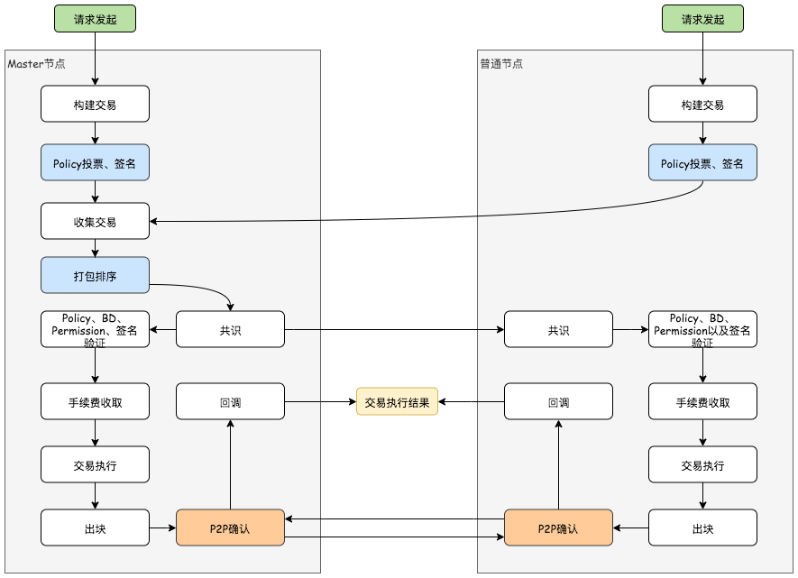

# 整体流程

!!! info "注意"
	*Master节点*在整个区块链网络中，同一时刻至多一个。相比*普通节点*，*Master节点*会额外将交易收集并打包，再下发到各个节点执行。

## 交易接收

*CRS*接口交易会验证参数的基础合法性，当交易入参通过验证即会被转化为系统内部交易。

## 投票签名

各个节点将交易提交到*Master节点*前，节点根据交易对应`Policy`配置的投票模式进行投票，收集投票结果并收集投票的签名信息，根据`Policy`配置的投票通过规则，最终再将通过投票的交易提交至*Master节点*。

!!! tip "提示"
	系统内目前共有三种投票通过规则，分别是：

	1. `FULL_VOTE`：全票通过，需要`同意数 = 参与投票的节点数` 
 	2. `ONE_VOTE`：一票通过，只需要至少有一个节点投同意票即可，`同意数 > 0` 
 	3.  `ASSIGN_NUM`：使用自定义的`Assign data`对同意数和节点数进行校验 

## 排序打包

当接受到各节点(包括Master节点自身)提交的交易后，*Master节点*还需要对待处理的交易进行**排序**后才能打包下发，一个包最大交易数量默认为：`200`。当打包完成就会放入等待队列，通过**共识协议**下发至各个节点。

!!! tip "提示"
	1.  对交易进行排序是为了确保各个节点在交易执行时顺序一致。如若不一致，则会各节点在共识流程，接受包时，验证失败。
	2.  排序是根据交易的交易编号进行排序。
	3.  包的交易数量上限配置：`stacs.batch.tx.limit`

## 协议层分发

通过**共识协议**将包分发到各个节点，系统目前一共有两种共识协议，可以通过修改项目的依赖配置来切换使用。

当收到从*Master节点*通过共识协议发送过来的包时，在执行交易前，各节点还需要验证包内的交易列表是按照`交易编号`**排序**的，成功接受包后，会将包中的交易保存入库，等待定时任务捕获并执行。

*   `Raft`共识协议：`consensus-atomix`、`consensus-sofajraft`
*   `BFT`共识协议：`consensus-smart`

!!! tip "提示"
    开发时可以使用`consensus-solo`启用*单节点*模式，方便测试、开发。

## 交易执行

当定时任务捕获到存在待执行的**下一个**包数据时，线程会从数据库中根据当`前节点区块高度 + 1`获取待执行的交易，并将它们**排序**，最后依次执行，待执行完成后批量入库。

!!! info "注意"
	Master节点也会收到从它共识出去的包，因此Master节点也会执行普通节点一样的交易。

### 交易执行前

在交易实际执行前需要依次进行以下步骤：

1.  根据`Policy`对不同种类交易进行校验 & `ActionList`中的`Action.index`从`0`开始自增
2.  根据交易对应的`BD`对提交者进行权限验证
3.  根据手续费配置，收取交易手续费

!!! info "注意"
	由于是先收取手续费，再执行交易。因此如果交易是转账一类的交易，如果在收取手续费之后，剩余余额不足完成实际交易时，该交易会执行失败，但该交易的手续费并不退还。

### 交易执行中

交易执行时，根据不同的交易类型，执行相应的业务逻辑。通常的交易执行，会将**变更的数据**写入对应的*缓存快照*中，在整个包执行完成后，一并执行持久化操作。

!!! tip "提示"
	缓存快照主要是为了减少在交易执行时，对数据库的访问次数，以提升性能。

### 交易执行后

交易执行后，会将所有非空的交易执行结果返回。如果是合约类型的交易(`合约创建`、`合约调用`)，会单独获取合约的执行结果，再保存至区块链上，之后将缓存的数据刷新至数据库中，再调用执行*单节点持久化回调*。

## P2P确认

### 发送P2P共识消息

节点向当前所有在网络(指区块链网络)中的节点发送它的交易处理结果(当前区块头部)，共识消息在发送失败时会自动重试`3`次。

!!! tip "提示"

	1. 消息重发配置项：`p2p.send.retryNum`
 	2. 共识消息可以通过`HTTP`或`RPC`发送，配置项：`network.rpc:http|rpc`

### 接受 & 处理P2P共识消息

接受到其他节点的共识消息时，节点会先根据消息中的`viewId`获取自身节点中对应的`view`，然后再根据`view`中的公钥，对消息进行验证，将通过验证的节点数据在加入缓存中，等待有足够的节点发送共识消息后，再一并处理共识消息。

处理共识消息时，先检测当前节点对应包状态为`WAIT_PERSIST_CONSENSUS`，进而在比较共识数据中的`块头(BlockHeader)`中的数据是否一致，进而执行*集群持久化回调*，再将包状态从`WAIT_PRESIST_CONSENSUS`变更为`PERSISTED`。

## 交易回调

P2P共识完成后，会执行*交易完成回调*。交易完成回调根据交易不同分为以下三种情况：

1.  节点离开：需要额外处理节点离开带来的数据变化
2.  除*节点离开*之外的其他系统操作：不做额外处理
3.  其余交易：`CRS`根据`DRS`设置的回调地址，传递交易结果。