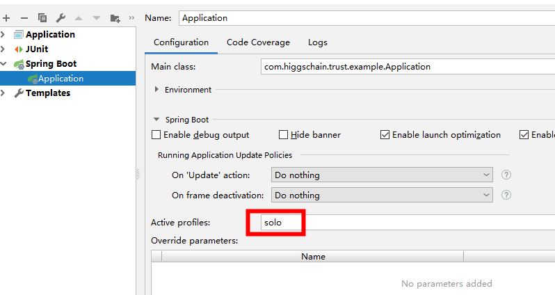
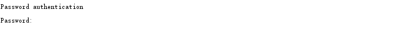
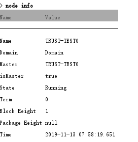
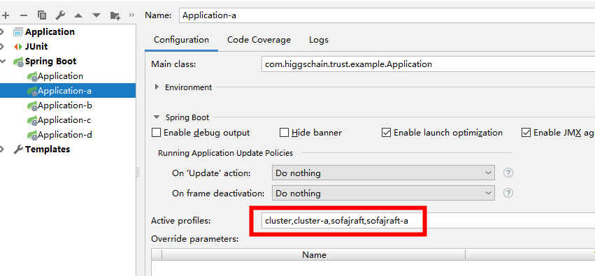
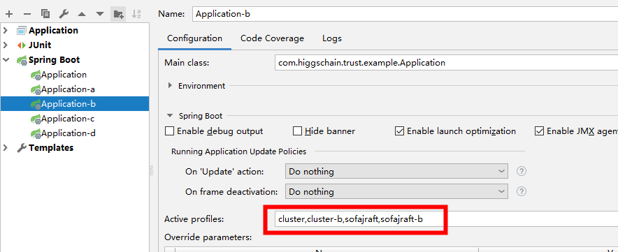
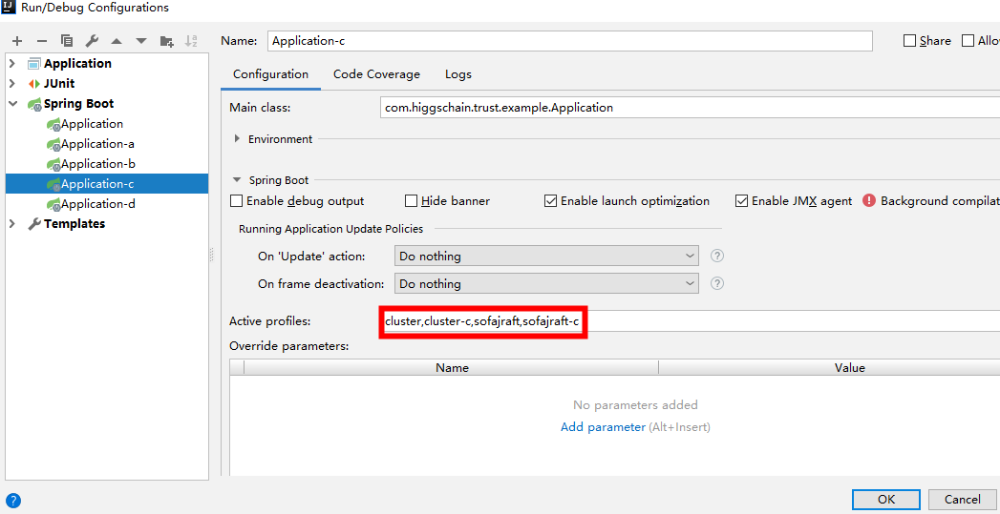
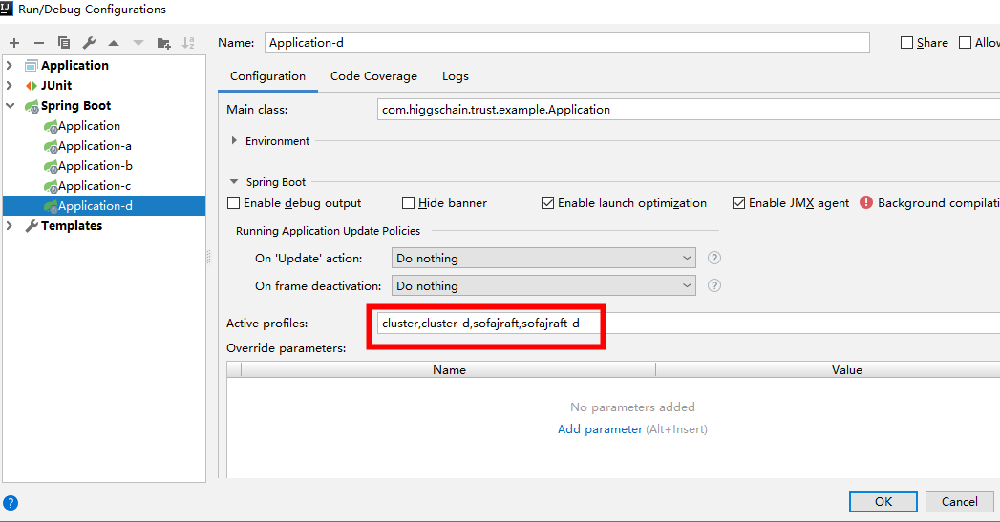
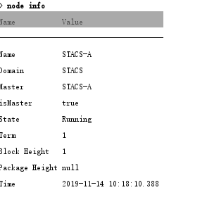

# 概述

# 安装

#### 环境依赖及工具(windows为例)

+ jdk8
+ idea
+ maven

#### 获取源码

+ 通过git下载源码

~~~
git clone https://github.com/Aurorasic/stacs-native.git
~~~

#### 编译

+ 导入项目到 `idea，maven` 自动下载相关依赖，跳过`test` ，执行 `maven package`   ，直到打包成功

#### 运行单节点

+ 运行`example` 的`Application` 启动类，并配置该类的为`active profiles` 为`solo` ，并启动

+ 启动完成后，通过`cli`  客户端验证启动， 进入`cmd` ，运行命令后提示输入`pass word` 

  

~~~
ssh user@localhost -p2000
~~~

  

+ 输入密码 

  

~~~
#密码输入pwd
pwd

#输入node info 回车,State状态为Running表示节点初始化成功
node info
~~~

#### 运行多节点

+ 配置`STACS-A,STACS-B,STACS-C,STACS-D` 4个节点作为集群节点，分别配置4个 `Spring Boot应用 profile` 

~~~
  STACS-A节点profiles：cluster,cluster-a,sofajraft,sofajraft-a
  STACS-B节点profiles：cluster,cluster-b,sofajraft,sofajraft-b
  STACS-C节点profiles：cluster,cluster-c,sofajraft,sofajraft-c
  STACS-D节点profiles：cluster,cluster-d,sofajraft,sofajraft-d
  
~~~

+ 项目所在根目录创建`app-data` 文件夹用于存储节点数据和日志

!!! tip "提示"

启动过程中可能会出现*initClusterViewFromCluster error *异常，这是启动过程中节点之间还未完全建立连接问题，待节点都启动完成错误会消失

+ 同时启动4个节点，节点启动完成时，进入`STACS-A` 节点查看节点状态为`running` ,表示节点启动正常

