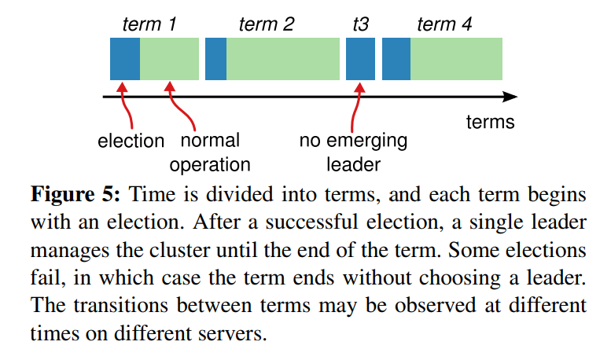
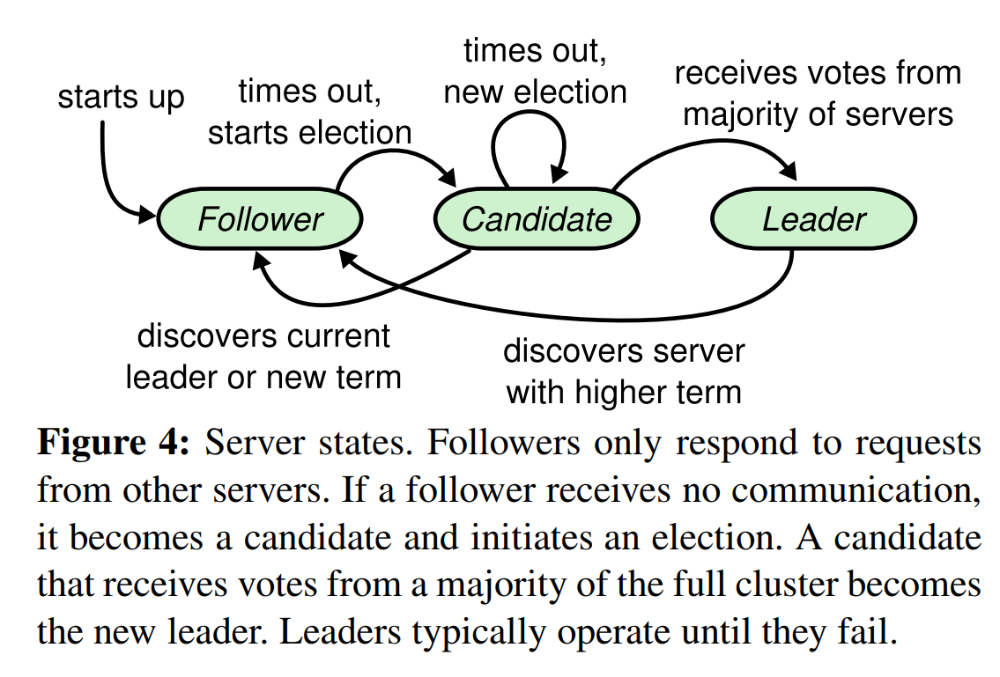
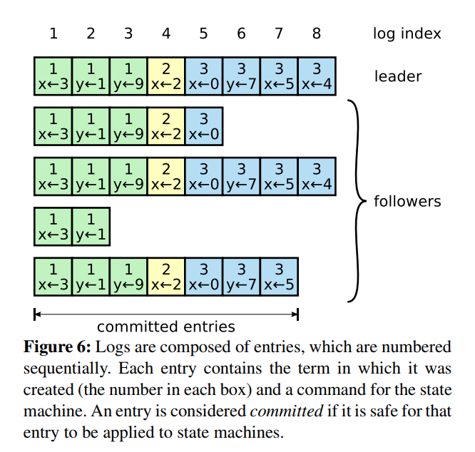
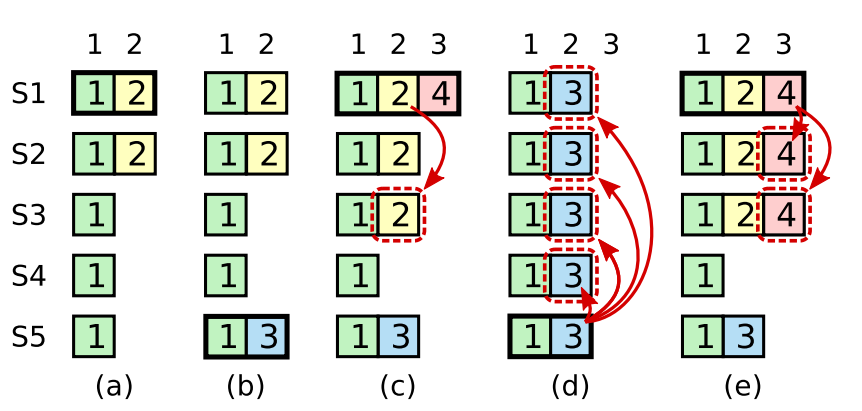

# **概述**
区块链是一个没有中央权威的分布式对等系统。虽然权力下放可以防止各方的腐败行为，但是它必需要有一个可靠的共识协议来作出决策，让分散在世界各地的节点可以形成一致的意见。常见的共识算法有比特币采用的POW，fabric使用的PBFT，以及分布式系统一般采用的RAFT等。

共识协议被许多人视为是区块链项目的核心。无论是对区块链平台的交易处理能力、扩展性影响还是对通证经济的激励模型设计，共识协议都会产生很大影响。

## **RAFT**
RAFT基于分布式系统中常见的CFT（Crash Fault Tolerance）问题，比如分布式系统中一些节点由于某些原因宕机造成的问题，RAFT协议正常运行的前提是要保证系统中至少一半以上（n/2+1）的节点可以正常运行。RAFT最主要的两个问题是选举（Leader selection)、日志复制(Log replication)和安全(Safety)。
### **选举(Leader selection)**
- Raft协议定义了三个角色，也可以说是三种状态：      
      
    * Follower（跟随者）：刚启动时系统中所有节点初始为Follower状态。      
    * Candidate（候选者）：负责选举投票；      
    * Leader（领导者）：负责日志的同步，处理客户端的请求以及保持和Follower的心跳联系。所有节点通过选举-投票机制选出Leader，每一个Leader都会对应一个任期（Term），每个任期都是一个连续递增的编号，整个系统会将拥有最大的Term的节点作为Leader（类比总统任期）。
    
+ 下图展示的是4个任期的变化，第三个因为选举-投票时间超时，此时会发起新的一轮投票。
  
+ 角色（状态）之间的转换方式如下图所示
  
  如图所示：系统刚开始启动的时候，所有节点都是follower，在一段时间内如果它们没有收到Leader的心跳信号，follower就会转化为Candidate；如果某个Candidate节点收到大多数节点的票，则这个Candidate就可以转化为Leader，其余的Candidate节点都会回到Follower状态；一旦一个Leader发现系统中存在一个Leader节点比自己拥有更高的任期(Term)，它就会转换为Follower。
- 两个消息
  
    1. RequestVote – 请求选票  
  包含当前节点的任期（Term）、当前节点的名称（CandidateName）、当前节点最新日志条目的任期及日志索引号[LastLogTerm, LastLogIndex]等信息。
    2. AppendEntries – 同步日志  
  日志条目同步消息是Leader节点定时发出的心跳信号，同时也作为日志同步的消息和日志提交消息 。
  
  消息内容主要包括：Leader节点名称（LeaderName）、当前任期（Term）、已提交索引号 （CommitIndex）、需同步日志条目的第一个索引号（PrevLogIndex）及已同步日志条目的最新任期信息（PrevLogTerm）等。
  
  当Leader节点初始启动时，会以Leader节点的最新日志条目[LastLogTerm, LastLogIndex]作为首次日志同步消息的PrevLogIndex，最新日志条目的前一个日志条目的任期号作为PrevLogTerm并将最 新日志条目作为同步的日志条目列表形成AppendEntries请求消息 。
  
  当Follower节点中PrevLogIndex之前的日志条目的任期与PrevLogTerm不一致，则说明存在 PrevLogIndex之前的日志条目与Leader不一致，需要同步PrevLogIndex之前的一个日志条目，直到找到Follower节点的日志条目与Leader的日志条目一致的索引号。

- 选举过程  
  
    1. **选举Leader**     
        + Raft的选举由定时器（Election Timeout）来触发，每个节点的选举定时器时间都是不一样的，是一个随机数。    
        + 开始时某个Follower节点的定时器触发选举，然后任期递增，角色由 Follower转为Candidate，向其他节点发起请求投票（RequestVote） 请求
        + 在一个任期每个节点只能投票一次，当投给某个节点后，就不能投给其他节点。    
        + 三种情况： 
              1. 收到majority的投票成为leader。
              2. 被告知他人已经当选Leader，该节点转换为follower. 
              3. 当有多个Candidate存在时就会出现每个Candidate发起的选举都存在接收到的投票数都不过半的问题，这个时候就会出现上图（Figure 5）中任期3出现的情况，则节点的任期值递增，重启选举定时器并重新发起选举。
        
    2. **Leader运行时注意的几点**
        + 该Candidate接收到过半数节点的投票，从Candidate转为Leader，并向其他节点发送心跳（heartBeat）以使得其他节点知道Leader正常运转。      
        + 节点收到其他Leader节点发送过来的数据复制请求，如果该Leader节点的任期值大则 当前节点转为Follower，否则保持Candidate拒绝该请求。      
        + 节点收到其他节点的投票请求，如果其他节点的任期值大，则当前节点转为Follower 节点并更新任期值为投票请求节点的任期值并投票给其他节点，否则保持Candidate 拒绝该请求。
        
### **日志复制**
在分布式系统中，有了Leader之后，客户端所有并发的请求可以在Leader这边形成一个有序的日志（状态）序列，以此来表示这些请求的先后处理顺序。Leader然后将自己的日志序列发送Follower，保持整个系统的全局一致性。

日志由有序编号（log index）的日志条目组成。每个日志条目包含它被创建时的任期号（term），和日志中包含的数据组成，日志包含的数据可以为任何类型，从简单类型到区块链的区块。每个日志条目可以用[ term, index, data]序列对表示，其中term表示任期， index表示索引号，data表示日志数据。

日志在节点上的形式如下：

日志由这些entry组成，每个log entry包含command和该log entry产生时的任期term。 从上图可以看到，五个节点的日志并不完全一致，raft算法为了保证高可用，并不是强一致性，而是最终一致性，leader会不断尝试给follower发log entries，直到所有节点的log entries都相同。

当然由于网络的不确定性，以及错误发生的不可预知性，在某一时刻，也有可能发生如下图的情况，图中a-f表示的是六种可能的节点状态。一些节点的日志可能比Leader节点长(cd)，也可能比它短(ab)，还有可能日志的某些部分不匹配(ef)。

   
    
此时算法会找到每一个Follower与Leader最长的一致日志的位置，比如，a状态是9，b状态是4，c状态是10，d状态是10，e状态是5，f状态是3。找到最长一致位置后，此时算法会删除Follower后面的不一致日志条目，同时将Leader的日志条目拉过来进行同步。

### **安全（Safety）**
Raft算法中提出安全性的概念，安全性是Raft算法保证每个节点的日志数据一致性的安全机制，主要包括如下的规则：

   + 选举权规则：拥有较新日志条目的Follower才有资格成为Leader。所谓较新的日志条目是指日志条目的[term, index]与一半节点的最后一个日志的条目 [term1, index1]比较，term >= term1并且index>=index1。满足该条件的节点才可能成 为leader，否则拒绝给相应节点投票。
   + Leader日志完整性规则（Leader Completeness Property）：仅Leader当前任期的日志条目被提交，才能更改日志条目的状态为提交状态。

例如出现如下情况：
     
 

   上面有五个阶段以及五个节点：

   - 首先第一个阶段（a），term为2，S1是Leader，且S1写入 日志条目[term, index]为[2, 2]，并且日志被同步写入了S2；
   - 在阶段b，S1离线，触发一次新的选主，此时S5被选为新的Leader，此时系统term为3， 且写入了日志[term, index]为[3，2]；
   - 在阶段c，S5离线，进而触发了一次新的选 主，S1重新变成Leader，此时系统term为 4，S1会将自己的日志条目[2，2]同步到了S3，此时该日志条目已经被同步到了多数节点（S1, S2, S3），所以此时这些日志是可以被committed的；
   - 现在问题来了，在阶段d，此时假设S1又宕机下线了，S5又重新当选，S5会把之前的日志条目[3,2]广播到其他节点(S1,S2,S3,S4)，而节点(S1,S2,S3)的日志条目的[2,2]会被覆盖 ，就会出现一种奇怪的现象，被复制的大多数节点会被日志回滚，即便事件已经被提交。
   
       这个时候根据**日志完整性规则**就会避免日志回滚事件的发生。该规则规定，当某个节点当选Leader后，不会直接提交该节点之前任期没有committed的日志条目，而是通过提交当前任期日志的同时，将之前任期的日志同步到其他节点，这样就不会出现d阶段的已提交的日志覆盖事情了，即 [2,2]条目不会被提交。如果刚刚当选的Leader节点当前任期没有日志条目，则会在当前任期提交一条空的日志条目。
   
   - 还有一种情况，在e阶段(S1是Leader)，在同步日志条目[4, 3]之后S1离线，由于[4, 3]条目已经复制到S1、S2、S3节点，为避免S4和S5变成主节点。由选举规则规定，拥有较新日志条目的Follower才有资格成为Leader，S5不会成为Leader，Leader只能在S2、S3中间产生。
## **PBFT**
PBFT(Practical Byzantine Fault Tolerance)，即实用拜占庭容错算法，该算法针对的问题与传统的分布式系统问题不一样，主要是针对系统中某些节点不再是单纯的出现宕机这种crash错误，同时也有节点会主动作恶，比如向系统中的其他节点发送错误消息，扰乱整个系统的正常运行。该算法在保证系统的安全性和可靠性的前提下提供了(n-1)/3的容错性，即允许系统有不多于三分之一的节点失效或者作恶。
### **算法流程**
主节点接收到来自客户端的请求后，按照三阶段协议向全网广播该消息。 主要包括预准备（pre-prepare）、准备（prepare）和确认（commit） 三个阶段。

   
     
副本0是主节点，副本3是失效节点，C是客户端。

   1.**客户端发起消息**
      
   - 客户端C向主节点发送操作请求<REQUEST,o,t,c>       
   - o: 请求执行状态机操作       
   - t: 客户端追加的时间戳       
   - c: 客户端标志       
   - REQUEST: 包含消息内容m，以及消息摘要d(m)等

   2.**预准备阶段**
    
在预准备阶段，主节点对收到的客户端请求消息签名进行验证，验证通过，基于当前视图v分配一个序列号n给收到的客户端请求，然后向所有备份节点群发送预准备消息< <PRE-PREPARE, v, n , d>, m>
       

   - v 视图编号     
   - m 客户端发送的请求消息     
   - d 请求消息m的摘要     
   - n 预准备消息序号

预准备消息的目的是作为一种证明，确定该请求已在视图v中被赋予了序号n，从而在视图变更的过程中消息仍可被追溯。

   3.**准备阶段**

副本节点i收到主节点的PRE-PREPARE消息，需要进行以下校验：

   - 主节点PRE-PREPARE消息签名是否正确。   
   - 当前副本节点是否已经收到了一条在同一v下并且编号也是n，但是签名不同的PRE-PREPARE信息。   
   - d与m的摘要是否一致。   
   - n是否在区间[h, H]内。

校验通过后，副本节点i向所有副本节点发送准备消息<PREPARE, v, n, d, i>，并将预准备消息和准备消息在节点i进行保存，用于View Change过程中恢复未完成的请求操作。

当节点i收到接超过2f+1个节点的准备消息后，就可以进入确认阶段。其中会检查这些消息的视图编号v，消息序号n 和摘要d。

   4.**确认阶段**

进入确认阶段的节点向其他节点包括主节点发送一条<COMMIT, v, n, d, i>确认消息。   
当节点i接受到2f+1个m的确认消息后并满足相应条件后，消息m变更为 committed-local状态，节点执行m的请求。      
在完成m请求的操作之后，每个副本节点都向客户端发送回复。进入reply阶段。

   5.**回应客户端**

节点i返回<REPLY, v, t, c, i, r>给客户端，r：是请求操作结果。客户端如果收到f+1个相同的REPLY消息，说明客户端发起的请求已经达成全网共识，否则客户端需要判断是否重新发送请求给主节点。
### **概念**
#### **视图（View）**

PBFT是一种状态机副本复制算法，算法中主节点由公式p = v mod |R|计算得到， 这里v是视图编号，p是副本编号，|R|是副本集合的个数。 当主节点失效的时候就需要启动视图更换（view change）过程。视图编号是连续的。

#### **Checkpoint 检查点**

算法设置周期性的检查点协议,将系统中的服务器同步到某一个相同的状态， 系统会设置一个checkpoint的时间点，在这个时刻可以定期地处理日志、节约资源并及时纠正服务器状态。 比如上述算法的执行流程中很多步都会将收到的消息以log的形式保存，便于发生ViewChange或者其他一些异常情况发生时，快速恢复，当相应的请求执行完之后，就需要将这些没有用的日志给清除，于是就使用了“批处理”类似的方法，利用请求消息序号n整除一个常数T（比如100）周期性向其他节点广播检查点消息<CHECKPOINT, n, d, i>，这里n是当前节点所保留的最后一个视图请求编号，d是状态的摘要，进而通知到其他节点，如果副本节点i收到了2f+1个验证过的CheckPoint消息，则清除先前日志中无用的消息，并以n作为当前一个stable checkpoint。而此时刻的请求序号n就是检查点。

   另一方面由于拜占庭节点的存在，算法不能保证每个节点执行了相同相同序列的请求， 即所有节点状态可能不一致。为了防止某些节点处理速度过快，会设置一个上文提到的高低水位区间[h, H]来解决这个问题。 这两个高低值限定了整个系统可以被接受的消息。 低水位h等于最近一次设置的stable checkpoint，而高水位 H=h+L，L通常是上述周期的倍数，比如2T。

#### **View Change protocol 视图转换协议**

   某个副本节点i检测出主节点作恶或者下线，会产生超时机制，启动视图更换，并将视图编号v变更为v+1，同时不再接受除检查点消息（checkpoint）、视图更换消息(view-change) 和新视图消息（new-view）外的其他消息请求。副本节点i会向其他节点广播视图更换消息<VIEW-CHANGE, v+1, n, C, P , i>   

   - 其中n是节点i的最新稳定检查点s的序号
   - C是证明s是稳定检查点的2f+1个检查点消息
   - P是所有序号大于n的所有prepared(m, v, n, i)为真的消息Pm(包括请求消息m的有效的预准备消息和与预准备消息一致的2f个准备消息。)

   其他副本节点知道主节点错误后，通过公式p = v mod |R|计算得到主节点p，当主节点p收到2f个来自其他复制节点的有效的视图更换消息后，节点p向其他复制节点广播新视图消息 <NEW-VIEW, v + 1, V, Q>：

   - V包含主节点收到的2f+1个有效的视图更换消息
   - Q包含有效的预准备消息

  这个时候有两种情况，判断上个view是否有未提交的消息 
      
   - 至少存在一个V中的视图变更消息的集合P中包含序号n，这说明存在一个预准备消息 m，则主节点向其他备份节点广播新的预准备消息<PRE-PREPARE, v+1, n, d>；   
   - V中所有的视图变更消息的集合P中都不包含序号n，则主节点向其他备份节点广播预 准备消息<PRE-PREPARE, v+1, n, dnull>，dnull是对null消息的签名，null消息执行空动作。

## **协议层快照**
  Stacs-Native使用RAFT或PBFT协议保证各节点的数据一致性，但伴随着节点加入/退出的业务需求，只是满足各节点的数据一致性还是不够的，区块链还需要记录每次集群变化的相关信息。当有节点变化时，我们需要把当前区块高度的view记录下来，用以确保该区块高度时的节点数据是一致的。

  我们需要记录的快照信息如下：

  - **ClustView 集群视图**
  
    + id 视图当前id，随集群节点变化时(加入/退出)递增
    
    + faultNumber 当前视图的容错数
    
    + startHeight 视图开始区块高度
    
    + endHeight   视图结束区块高度
    
    + nodes       当前所有节点信息
    
  - **TermInfo  业务master任期信息**
    
    + term        master任期
    
    + startHeight master切换时的区块开始高度
    
    + endHeight   master切换时的区块结束高度
    
    + time        任期切换的时间
    