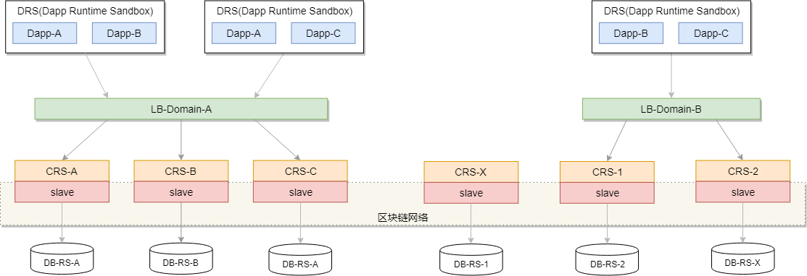
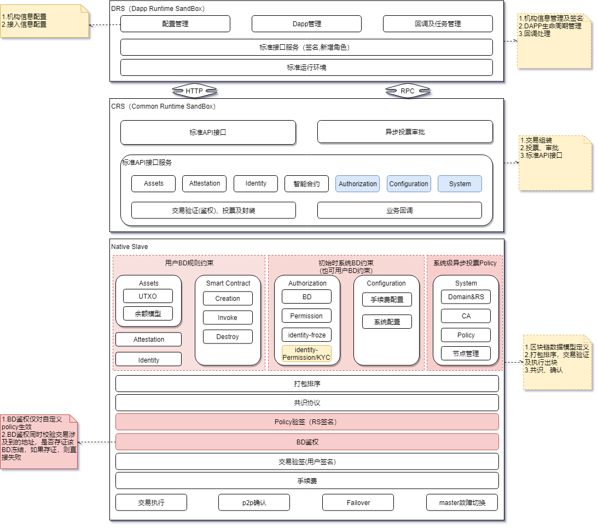

## **概述**
STACS-Native的设计目标是为用户提供可靠、稳定、灵活的可支撑复杂业务的区块链系统。其整体架构如下图所示：

STACS-Native整体架构图

DRS为DApp提供标准运行环境以及DApp完整生命周期的管理，DRS内可以运行一个或是多个DApp。
同时DRS还封装了与CRS的通信过程，简化DApp的接入流程。DRS通过某一Domain的LoadBalance(LB)连接到Domain所属的任一节点。通过这种方式实现了DRS与Domain通信的高可用与稳定性。

CRS与Slave一起构成了底层的区块链网络。CRS负责接收交易，并依据交易Policy所定义的背书投票规则，寻找Domain各节点完成投票、交易封装以及交易提交Slave。
Slave是区块链核心所在，一方面负责上层业务的承接，定义基础的业务数据模型;另一方面实现区块链核心功能，如打包排序、交易共识、交易执行、P2P确认，业务Master等。

在层次结构上，STACS-Native自上而下由DRS、CRS和Slave三个层次构成，如下图所示：

STACS-Native层次结构图

## **DRS(DApp Runtime Sandbox)**
DRS(DApp Runtime Sandbox)，DApp运行沙盒。为DApp提供标准运行环境、标准接口服务、配置管理、DApp生命周期管理及回调和任务管理。每个DRS可以运行一个或多个DApp。

- ### 标准运行环境
DRS为DApp提供标准运行环境，只要是依照STACS-DApp开发规范开发的DApp都可以运行在任一DRS上，提升DApp的可移植性；同时DRS还为每个DApp提供独立的运行环境，如独立的类加载器、独立数据库、独立配置等。

- ### 标准接口服务
DRS为DApp提供可靠的接口服务，DApp交易提交后，会有DSR负责可靠投递到CRS,并在底层区块链处理完成后，回调上层DApp。

!!! tip "提示"
    DRS API参见[DRS接口参考][1]。
    

- ### 配置管理
配置管理主要负责DRS相关配置，主要包括如下几项：

      - 数据源：默认采用H2数据库，用户可以通过该配置项选择其他类型的关系型数据库。
      - AppStore: 配置AppStore地址，默认为官方AppStore,用户可以使用自己或第三方AppStore。
      - 区块链连接配置：配置DRS连接区块链的节点地址，公私钥等配置。
      - 回调地址：区块链底层交易处理完成之后通知DRS时所需要的地址。
  
- ### DApp生命周期管理
DRS另一个比较重要的功能就是DApp生命周期管理，他负责DApp的下载、配置、安装、卸载、更新。

## **CRS(Common Runtime Sandbox)**

CRS与区块链底层Slave紧密结合，其主要职责是接收外部交易，并依据交易Policy所定义的背书投票规则背书投票，以及私密交易的确认。

- ### CRS标准接口 

!!! tip "提示"
    CRS接口参见[CRS接口文档][2]。
    

- ### 投票背书及交易组装
CRS收到上层交易后，首先会依据交易Policy的约束规则，寻找需要投票背书的domain节点，发起投票背书；当domain节点在确认交易无误后，会进行投票背书并将结果提交发起背书的CRS节点；
CRS节点在收到投票后验证是否已满足Policy策略，如果满足则会组装交易并提交Slave,否则交易直接失败。

!!! tip "提示"
    Policy背书规则参见[Policy][3]

- ### 私密交易确认
私密交易确认是[私有数据][10]中私密交易的准备阶段，该阶段主要是发起方将原始交易加密后转为私密交易，并将私密交易发送至私密交易确认方，由私密交易确认方预执行交易，
然后将交易执行结果和当前的私密数据状态作为响应结果提交给发起方，发起方根据确认策略确认无误后组装交易并提交Slave。

- ### 交易回调

## **Slave** 
Slave是STACS-Native的核心，提供了基础的金融业务数据模型、交易打包排序、流程处理、共识、验签、系统故障容错等区块链核心功能。
在设计上采用共识与交易执行并行的方式，以此来提升系统性能。

### 交易数据模型

为满足金融业务，Slave提供了[BD][4]、[Identity][5]、[Permission][6]等交易数据模型，主要分为如下几类：

- 系统类：包括Domain&RS、CA、Policy、节点管理。系统类业务交易只能由RS节点发起，不开放给DApp。
- 配置类：系统配置、手续费配置等，初始为系统级操作业务，对DApp开放，BD授权后即可调用执行。
- 授权类：BD、Permission、Identity-Permission/KYC/Froze。主要负责管理系统授权，[BD][4]主要约束合约执行的权限与Policy, Permission负责注册权限，同时可授予Identity。
对于Identity还有另外一个比较重要的属性KYC，KYC的设置需要具有特定Permission的Identity执行。同时KYC可以在智能合约中验证，以此来约束某一类用户的合约执行。
- 合约类：主要是合约的发布与执行。
- 账务类：支持UTXO和余额模型两种账务模型
- 其他： 存证

!!! Note "注意"
    除系统类交易外，其他交易都允许通过BD约束的形式开放给用户使用。

### 交易流程
交易流程是Slave的核心部分，主要负责各节点能够线性一致的依次顺序执行RS下发的交易，同时就交易结果打成共识并形成区块。
流程包括交易打包排序、共识、验证、交易执行、p2p确认以及回调等。

!!! tip "提示"
    更多交易流程的详细描述参见[交易流程][7]。

### 业务Master
在多节点并发提交交易的情况下，如何保证各节点能够执行顺序一致的交易，就需要在所有节点中选择一个Master节点，让该节点负责交易的打包排序，我们称该节点为业务Master。
业务Master的主要功能就是收集各节点发的交易，每50毫秒或满200个交易时打包交易Package并提交至[共识层][8]。

### Failover
节点在网络故障或是出现网络抖动，未收到交易数据，如何保证节点能够快速恢复，并在恢复后能继续参与共识。

[1]: ../api/drs-api.md
[2]: ../api/crs-api.md
[3]: policy.md
[4]: bd.md
[5]: identity.md
[6]: permission.md
[7]: transaction-process.md
[8]: ../consensus.md
[9]: master.md
[10]: private-data.md
[11]: failover.md

