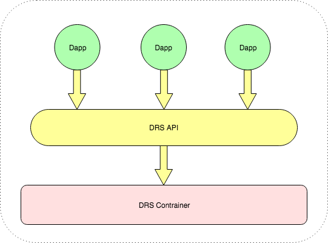

### 什么是STACSDApp

DApp(Decentralized Application)：去中心化的应用程序。目前传统的区块链DApp是以智能合约为基础，在其之上实现一整套的业务逻辑及数据处理。 而STACSDApp是以BD为基础，实现BD的部分或全部业务功能，不同DApp各自执行BD的一个或多个业务功能，多个STACSDApp相互协助执行BD，从而解决在金融业务执行过程中的分权问题。

- 现在世面上DApp大都是以游戏、博彩类的应用为主，STACSDApp是唯一一个面向金融机构，并运行在可信区块链基础之上的应用，能够帮助金融机构快速搭建基于区块链的各种实际应用，如：证券交易、资产转让、结息、认购等。DApp提供多种针对金融业务场景的管理策略，确保支持各类金融业务。

- STACSDApp提供统一的运行环境:DRS，使用者可以根据需要选择已有的DApp来安装、运行。并可以自己开发、提交应用，经过社区审核通过后，其他组织/个人就可以使用你开发的应用。

- STACSDApp提供友好的开发界面，开发者可以像开发普通应用一样开发DApp,只需要按照开发规范搭建环境编译打包即可安装运行。

- 每个STACSDApp都是互相隔离的，彼此不能直接通信，都可以有自己的数据库，各自拥有各自的数据。

- 由于每个DApp运行在统一的平台上，可以享用平台提供的统一接口，平台确保DApp提交的交易到区块链的可靠性，同时采用事件通知的形式保证区块链出块后回执处理的及时性。

- 对于DApp我们提供了几个常用接口：BD的发布、Identity注册、KYC绑定、Policy注册、智能合约的发布及调用等。

- 以上所有接口均由BD的定义来约束其相关权限，任何一个交易都由policy来定义其在可信链上的投票协议，从而做到了真正能够面向金融业务的实际可行的解决方案。

- STACSDApp的智能合约支持以太坊的Solidity。

- STACSDApp采用Java语言编写，平台源代码均开源，我们拥有活跃的社区、丰富的文档，能够帮助开发者快速搭建自己的DApp。

### 各组件关系图

 

### 如何使用

每一个DApp都运行在DRS中，所以首先需要下载并安装DApp的运行环境：DRS

#### DRS安装
- 下载DRS镜像包
- 执行java命令启动： ` java -jar stacs-drs-executable-1.0.jar `

#### DRS配置
- 在浏览器上输入当前节点的IP地址，端口号默认8080,例如：` http://127.0.0.1:8080/drs/index.html `
- 找到`系统配置`选项，根据需要可以配置：`app-store地址`、`domain地址`、`回调地址`、`dapp下载目录`、`dapp配置文件目录`

#### DApp安装
- 打开 `app-store` 页签选择要安装的DApp
- 点击 `下载` 即可自动下载该DApp到配置的目录下
- 点击 `配置` 按钮，配置该DApp需要的相关配置项 
- 配置完成后，点击`安装`按钮即可安装
- 安装完成后，点击`打开`按钮即可访问该DApp

### DApp 依赖&打包

#### 依赖
STACSDApp 需要使用Maven来管理依赖，需要添加 `parent` maven坐标：
``` 
<parent>
    <artifactId>stacs-native-dapp</artifactId>
    <groupId>io.stacs.nav</groupId>
    <version>1.0.0-SNAPSHOT</version>
</parent>
```
##### 包结构管理
```
    <dependency>
        <groupId>com.alipay.sofa</groupId>
        <artifactId>web-ark-plugin</artifactId>
    </dependency>
    <dependency>
        <groupId>com.alipay.sofa</groupId>
        <artifactId>sofa-ark-springboot-starter</artifactId>
    </dependency>
```
##### DRS-API
```
    <dependency>
        <groupId>io.stacs.nav</groupId>
        <artifactId>drs-api</artifactId>
    </dependency>
    <dependency>
        <groupId>io.stacs.nav</groupId>
        <artifactId>dapp-core</artifactId>
    </dependency>
```
#### 打包
DApp可以是普通Java工程，也可以是Spring-boot工程，只需要使用 Maven 插件 `sofa-ark-maven-plugin` 打包生成即可：
```
<build>
    <plugin>
        <groupId>com.alipay.sofa</groupId>
        <artifactId>sofa-ark-maven-plugin</artifactId>
        <version>${sofa.ark.version}</version>
        <executions>
            <execution>
                <id>default-cli</id>
                <goals>
                    <goal>repackage</goal>
                </goals>
            </excution>
        </executions>
        <configuration>
             <attach>true</attach>
             <outputDirectory>target</outputDirectory>
             <webContextPath>sample</webContextPath>
        </configuration>
    </plugin>
</build>

```
##### 配置说明：
- outputDirectory  
   打包文件的输出目录。
- webContextPath   
   若是web项目，该项配置会被默认替换为dapp的name,不支持自定义
- dapp spring-boot Application类需配置包扫描路径：io.stacs.nav.dapp"


[1]: dapp.md
[2]: https://github.com/Aurorasic/stacs-native-dapp/tree/dev/dapp-sample
