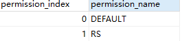

### 概述

+ 整个链我们对参与者进行了 身份的抽象，同时我们对于身份赋予了permission【类似权限】，permission可以更加细粒度的控制参与者参加业务的控制范围。当定制业务时需要制定参与各业务的权限，参与者必须具备交易要求的权限才能参与业务操作。

###  permission定义

+ permission结构

  + permissionIndex：每个permission都对应一个index，且index为正整数，每添加一个permission，index会自动加1,permission只可以添加不可以删除。

  + permissionName：名称整个链不允许重复

    

+ 系统预留0-20个整数的permission
  + DEFAULT （index为0）：Idendity默认的的permission，如果定义的BD业务默认允许所有的Identity都可以参与业务，那么可以将permission设置为DEFAULT。
  + RS （index为0）:可以执行CRSFunction交易（具体参考BD交易）

+ 添加permission
  + 通过发送Permission注册交易添加新的permission，

### 用户permission授权流程

+ 通过 “/permission/open/authorize” 接口给地址添加权限，接口参数
identityAddress：授权Identity地址
permissionNames：授权的permission集合，可同时授权多个permission
identityType：Identity类型1. user 2. domain 3. node

~~~
    {
    "permissionNames":["VP","AIP"]
    "identityAddress":"2b236839774975579cd28704438264cac795e25b"
    "identityType":"1"
    }
~~~

+ 链在计算“2b236839774975579cd28704438264cac795e25b”的permission时，会对多个permission进行与或操作

~~~
/**
      DEFAULT:0 转换为2的index次方等于1
      VIP:1 转换为2的index次方等于2
      AIP:2 转换为2的index次方等于4
       */

      BigInteger DEFAULT = new BigInteger("2").pow(0);
      BigInteger VIP = new BigInteger("2").pow(1);
      BigInteger AIP = new BigInteger("2").pow(2);

      //对转换的permission求余
       BigInteger d= DEFAULT.or(VIP).or(AIP);
      //对求余的permission再次转换为32进制，最终Identity的permission记为7
      System.out.println(d.toString(32));
~~~

  

### permission验证

+ 当【2b236839774975579cd28704438264cac795e25b】发送一笔交易执行的permission为VIP，那么验证流程如下；

+ 会查询该identity的permission，通过上一个流程为用户添加了三个permission，为7；

+ 当前交易执行的permission为1，会将1转为2的1次方为2；

+ 7和2做and操作结果为2，再将结果与交易的permission比较，如果相等则验证通过。

~~~
       //用户permission和VIP做and操作
      BigInteger e = d.and(VIP);
      int result = e.compareTo(VIP);
      System.out.println("如果result等于0，则验证通过");
~~~

  