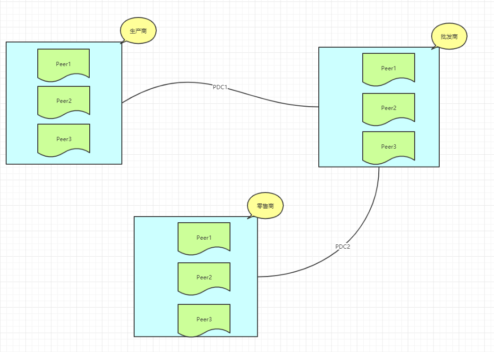
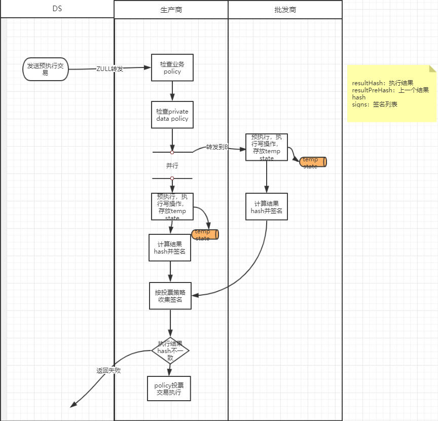
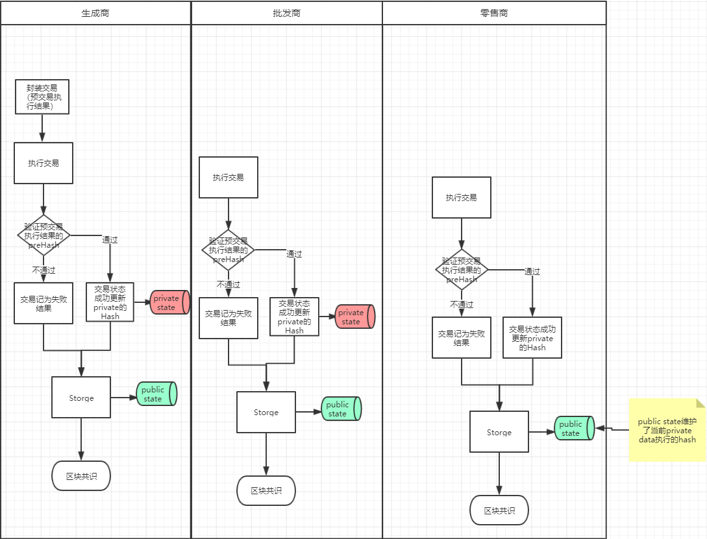
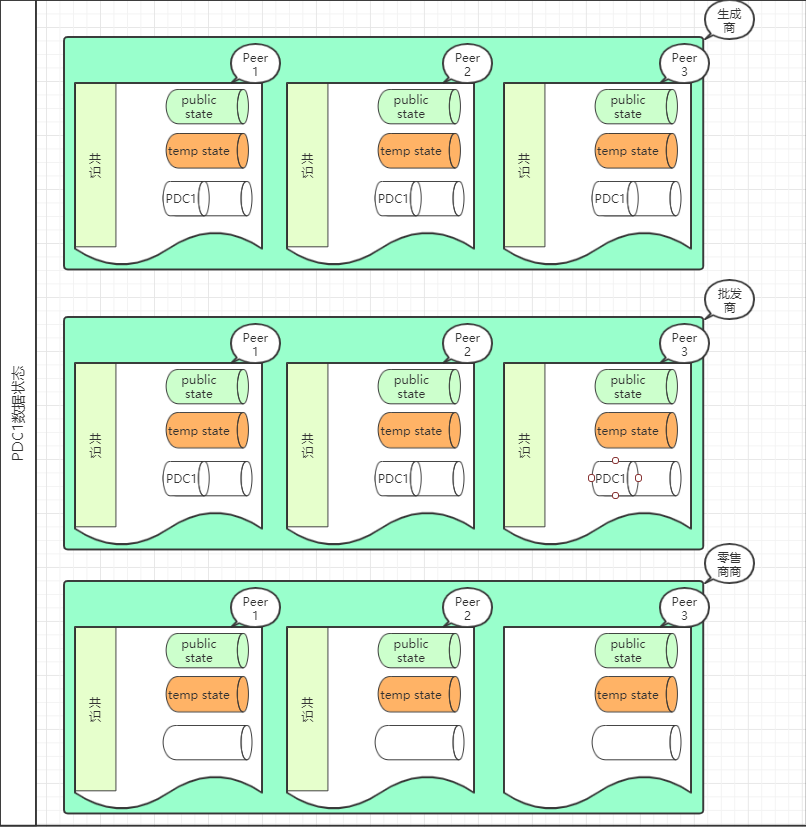

## **业务场景**
+ 在整个链上机构组之间存在私密的业务，那么整个业务的定义元数据和执行只在授权的机构间传递和执行，对第三方不可见，定义私有数据有(storePolicy,
readPolicy,endorsorPolicy)需要定义私有数据存储策略，读取策略，签名背书策略
+ 真实的私有数据：真实的私有数据会在storePolicy定义授权的节点存储并可见，这个数据会存储在授权节点的私有数据库中(也可以叫旁库)，
当然真实的私有数据页不会非授权的节点传递和执行。
+ 数据hash：为了保障全网链的整体共识，当私有业务在授权的节点执行时，我们需要把预执行交易执行结果hash等相关数据传递到全网节点。
+ 实例：由生产商，批发商，和零售商组成的区块网络，假设批发商从生产商进某种产品单价为1元/件，而批发商批发给零售商是1.5元/件，但这种商业机密
批发商不想让零售商知道他的进货价，由此生产商和进货商组成了【PDC1】，批发商也不想让生产商知道它自己的批发价，那么批发商和零售商组成了【PDC2】
+  PDC1：定义了生产商和开发商进货价格的定义，进货记录的数据只会由PW的节点进行维护私有数据；
+  PDC2：定义了批发商和零售商进货价格的定义，进货记录的数据只会由WR的节点进行维护私有数据；
+  R：零售商
+  P：生产商
+  W：批发商

## **如何实现私有数据**
### **私有数据定义**
+ Private Data Collection（PDC）
+ code：合约地址
+ storePolicy：授权存储和执行私有数据的机构，支持or(...,...)语法；
+ readPolicy: or(P,W,R) 支持可读取私有数据的机构，支持or(...,...)语法，如果readMethod未定义，表示除storePolicy授权机构外无任何机构
可访问；
+ readMethod：授权哪些合约方法被用于可读取支持or(...,...)语法；
+endorsorPolicy: 在预执行时，授权机构对交易签名投票；
### **私有数据发布流程**
+ 编写合约
~~~
pragma solidity ^0.4.24;
contract stock{
    //价格
    uint256 price = 1;
    //生成商数量
    uint256 num = 100;
    //批发商数量
    uint256 numOfW = 0;
    //批发商以price单价去购买,
    function buy(uint256 buyPrice,uint256 num){
        
    }
    //零售商可以查询批发商的数量
    function getAbliveNum() view returns(uint256 n){
        return numOfW;
    }
} 
~~~

+ 定义PDC
{
code:stock合约
storePolicy：eq(P,W),  #P和W才有权限存储私有数据
readPolicy: or(P,W,R), #零售商可以查询有哪些商品
readMethod：or(getAbliveNum), #查询批发商的数量
endorsorPolicy:and(P,W), #执行私有数据签名策略，P和W必须签名
}
### **私有数据执行流程**

### **PDC1流程**

1. 定义PDC；

2. P或W发送private交易，交易包含私业务的合约和PDC定义；

3. 被授权节点收到该交易会对该交易进行收集签名，执行结果会临时存放到Temp state库中，storePolicy的Domain必须全部签名投票（同步异步待定），全票通过后RS再封装预执行的结果（hash，上一个版本hash，PDC），再提交Master节点；

4. Master验证该交易为私有，会验提交的签名集为授权节点所有投票通过，Master提交Package并分发到所有Slave节点；

5. 各节点收到package中包含private tx时，会检查发布交易预执行的签名集合满足Policy定义的授权节点，并检查上一个版本hash是否和当前节点库维护的上一个版本hash相等（所有节点会为维护私有交易hash历史）；

​       验证成功：2个条件都验证成功，交易执行状态为成功，并维护预执行结果hash；

​       验证失败：交易执行状态为失败（不更新预执行结果hash树）；

​       授权节点：(P机构和W机构将temp state 更新到 private state)；

6. 节点共识，出块，交易上链；

7. 当批发商执行buy方法，私有交易预执行只能在PW上执行，其他流程和上面发布一致；

8. 零售商合约节点可以发起向P或W查询getAbliveNum来获取可进货的数量。

   **PDC1预执行流程图**

   

   **PDC1预执行结果上链流程图**

   

   

   **PDC1执行后状态**

   

**PDC2执行后各节点Private state状态**

+ PDC2执行后生产商拥有PDC1的私有数据，零售商拥有PDC2的私有数据，而批发商同时拥有PDC1和PDC2的私有数据。
