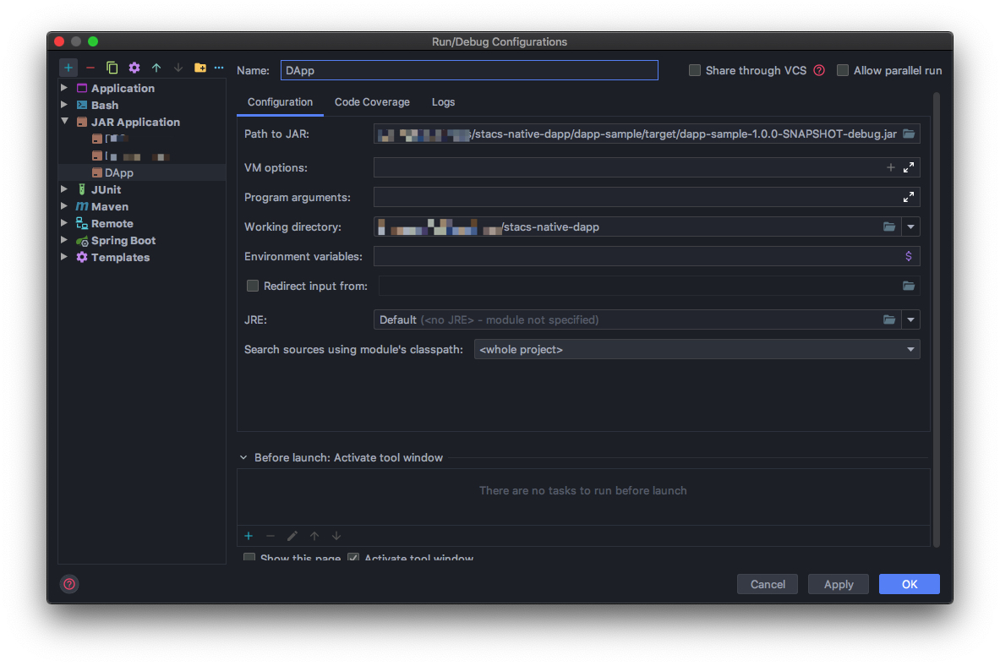

1.  配置文件怎么配置（针对开发）

# 开发调试

## 开发运行/调试示例

### IDEA 配置



如图所示

1.  创建一个新的`Run/Debug Configuration`，选择`JAR Application`
2.  `Path to Jar`选择 *DApp* `debug包`所在路径（需要先执行**打包流程**）
3.  点击`OK`即可

### Eclipse 配置


1.  在`Run > External Tools > External tools Configurations`选择`External Tool`
2.  如上图创建一个运行设置，配置`debug包`文件路径即可。

## DRS 配置修改

>   如果需要修改 *DRS*配置请参考以下配置项

!!! warning "注意"
    *DRS* 配置文件名称必须为`boot`，例如：`boot.properties`、`boot-dev.yml`。

### DRS 通用配置

```properties
spring.jmx.default-domain=DRS
# spring.profiles.active=mysql 
spring.profiles.active=h2
server.port=8080

# dapp 相关配置
drs.dir=drs
drs.download-path=${drs.dir}/download
drs.config-path=${drs.dir}/config
drs.dapp-store-path=http://

# 区块链 domain 配置
drs.domain.baseUrl=http://localhost:7070/
drs.domain.chainPubKey=04711e86d74444c10d7506dbcfcb861ae1280a384ba617802a02d81ea99ca70f015d67e4efc3630331143f53fe18dca733d3802552225b17289e0ce13cac648823
drs.domain.merchantPriKey=78637c920bc993f50c038fa146b917fc625793e59f677cdbfbbe1c46b7fd407a
drs.domain.aesKey=gsp-sto-12sd9ie4
drs.domain.merchantId=default
drs.domain.callbackUrl=http://localhost:8080/drs/callback

# 数据源配置
spring.datasource.druid.initialSize= 1
spring.datasource.druid.maxActive= 20
spring.datasource.druid.maxWait= 5000
spring.datasource.druid.min-evictable-idle-time-millis= 300000
spring.datasource.druid.minIdle= 1
spring.datasource.druid.validation-query=select 1 from dual
spring.datasource.druid.time-between-eviction-runs-millis= 60000

# 以下配置不能修改
spring.datasource.type=com.alibaba.druid.pool.DruidDataSource
# mybatis 配置
mybatis.configLocation = classpath:mybatis-config.xml
mybatis.mapper-locations = classpath*:mybatis/**/*Mapper.xml
```

#### H2 配置

```properties
# H2
# h2 数据库名称，需要配置为绝对路径
h2.database.name=./drs
spring.datasource.druid.url=jdbc:h2:${h2.database.name};DB_CLOSE_DELAY=-1
spring.h2.console.enabled=true
spring.h2.console.path=/h2-console
spring.datasource.druid.username=root
spring.datasource.druid.password=root

# 以下配置不能修改
spring.datasource.DruidDataSourceFactory.driver-class-name=org.h2.Driver
spring.datasource.schema=classpath:h2/schema.sql
```

#### MySQL 配置

```properties
# MySQL
spring.datasource.druid.url=jdbc:mysql://localhost:3306/drs?useUnicode=true&characterEncoding=UTF8&allowMultiQueries=true&useAffectedRows=true
spring.datasource.druid.username=root
spring.datasource.druid.password=root

# 以下配置不能修改
spring.datasource.DruidDataSourceFactory.driver-class-name=com.mysql.jdbc.Driver
```

##### MySQL 初始化 SQL

```mysql
-- init 1.0.0
CREATE TABLE IF NOT EXISTS `app_info` (
  `id` bigint(20) NOT NULL AUTO_INCREMENT,
  `name` varchar(64) NOT NULL COMMENT 'the app name',
  `version` VARCHAR(16) NOT NULL  COMMENT 'the app version',
  `context_path` varchar(32) DEFAULT NULL COMMENT 'context path for web app',
  `status` varchar(16) NOT NULL COMMENT 'status,DOWNLOAD、INITIALIZED、RUNNING、STOPPED',
  `run_error` varchar(128) DEFAULT NULL COMMENT 'app run error info',
  `file_name` varchar(64) NOT NULL COMMENT 'app jar file name',
  `icon` varchar(128) DEFAULT NULL COMMENT 'app icon url',
  `author` varchar(64) DEFAULT NULL COMMENT 'author of app ',
  `remark` varchar(128) DEFAULT NULL COMMENT 'the app description',
  `create_time` datetime NOT NULL DEFAULT CURRENT_TIMESTAMP  COMMENT 'create time',
  `update_time` datetime DEFAULT CURRENT_TIMESTAMP COMMENT 'update time',
  PRIMARY KEY (`id`),
  UNIQUE KEY `uniq_name` (`name`)
) ENGINE=InnoDB DEFAULT CHARSET=utf8mb4 COMMENT 'the dapp info table';


CREATE TABLE IF NOT EXISTS `tx_request` (
  `id` bigint(20) NOT NULL AUTO_INCREMENT,
  `tx_id` varchar(64) NOT NULL COMMENT 'the transaction id',
  `policy_id` varchar(32) NOT NULL COMMENT 'policy id',
  `submitter` varchar(40) NOT NULL COMMENT 'tx submitter',
  `bd_code` varchar(32) NOT NULL COMMENT 'tx business code',
  `func_name` varchar(128) NOT NULL COMMENT 'tx function name for BD',
  `tx_data` MEDIUMTEXT NOT NULL  COMMENT 'the request json data',
  `block_height` bigint(20) DEFAULT NULL COMMENT 'block height',
  `tx_receipt` TEXT DEFAULT NULL COMMENT 'tx receipt json data',
  `status` varchar(16) NOT NULL COMMENT 'status,INIT、SUBMITTING、PROCESSING、END',
  `create_time` datetime NOT NULL DEFAULT CURRENT_TIMESTAMP  COMMENT 'create time',
  `update_time` datetime DEFAULT CURRENT_TIMESTAMP COMMENT 'update time',
  PRIMARY KEY (`id`),
  UNIQUE KEY `uniq_tx_id` (`tx_id`)
) ENGINE=InnoDB DEFAULT CHARSET=utf8mb4 COMMENT 'the request tx info';

CREATE TABLE IF NOT EXISTS `tx_callback` (
  `id` bigint(20) NOT NULL AUTO_INCREMENT,
  `block_height` bigint(20) DEFAULT NULL COMMENT 'block height',
  `tx_receipts` TEXT DEFAULT NULL COMMENT 'tx receipt json datas',
  `status` varchar(16) NOT NULL COMMENT 'status,INIT、PROCESSED',
  `create_time` datetime NOT NULL DEFAULT CURRENT_TIMESTAMP  COMMENT 'create time',
  `update_time` datetime DEFAULT CURRENT_TIMESTAMP COMMENT 'update time',
  PRIMARY KEY (`id`),
  UNIQUE KEY `uniq_block_height` (`block_height`)
) ENGINE=InnoDB DEFAULT CHARSET=utf8mb4 COMMENT 'the callback info';
```

