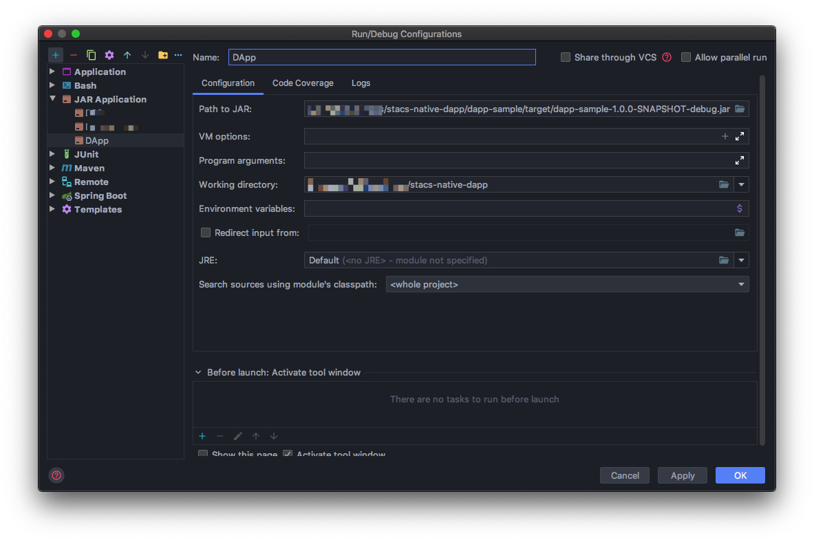
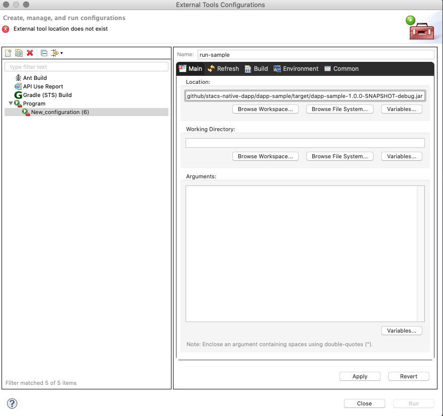

# DApp 开发手册

[DApp示例工程](https://github.com/Aurorasic/stacs-native-dapp/tree/dev_1.0.0/dapp-sample)

## 基础准备

### Maven 依赖

开发`DApp` 需要引入`drs-api`、`drs-core`依赖，包含了`DRS`接口、错误类、事件回调、参数VO等基础模块。

```xml
<dependency>
  <groupId>io.stacs.nav</groupId>
  <artifactId>drs-api</artifactId>
  <version>1.0.0-SNAPSHOT</version>
</dependency>
<dependency>
  <groupId>io.stacs.nav</groupId>
  <artifactId>drs-core</artifactId>
  <version>1.0.0-SNAPSHOT</version>
</dependency>

<dependency>
    <groupId>com.alipay.sofa</groupId>
    <artifactId>web-ark-plugin</artifactId>
    <version>1.0.0</version>
</dependency>
<dependency>
    <groupId>com.alipay.sofa</groupId>
    <artifactId>sofa-ark-springboot-starter</artifactId>
    <version>1.0.0</version>
</dependency>
```

### Maven 打包插件

```xml
<build>
  <plugins>
    <plugin>
      <groupId>io.stacs.nav</groupId>
      <artifactId>dapp-maven-plugin</artifactId>
      <version>1.0.0-SNAPSHOT</version>
      <executions>
        <execution>
          <id>default-cli</id>
          <goals>
            <!-- 指定执行参数，不能修改 -->
            <goal>package</goal>
          </goals>
        </execution>
      </executions>
      <configuration>
        <!-- DApp页面资源路径 -->
        <webContextPath>sample</webContextPath>
      </configuration>
    </plugin>
  </plugins>
</build>
```

>   插件会自动获取当前项目依赖的`drs-api`版本，默认情况下会打出两个包：
>
>   *   `dapp`：提交DRS实际执行的包
>   *   `debug`：开发使用，自带对应`drs-api`版本的运行环境，可以通过jar包直接运行
>   *   更多参数配置详见[1]

### DRS内部配置自定义

用户可以通过运行`debug`时，传入`spring.config.location`参数，指定配置文件所在**目录**。

```shell
$ java -jar dapp-sample-1.0.0-SNAPSHOT-debug.jar \
	--spring.config.location={配置文件所在目录的路径}/
```

>   *   路径后面必须要包含`/`，才能被`spring`识别为目录，进而加载对应配置
>
>   *   `drs-boot`配置文件名称必须为：`boot.properties`
>   *   完整参数请见[2]

## 开发示例

### DRS API 调用示例

```java
@Service @Slf4j public class SampleService {

    @ArkInject IDappApiService dappService;

    public RespData<?> authPermission(AuthPermissionVO vo) {
        log.info("dapp calling authPermission service ...");
        try {
            dappService.authPermission(vo);
          	log.info("authPermission service success");
            return success();
        } catch (DappException e) {
            log.error("authPermission service has error:", e);
            return fail(e);
        }
    }
}
```

>   *   注意：​DRS*交易提交*接口返回值均为`void`，需要等待*DRS*通过回调通知DApp交易执行完毕。
>   *   *DRS*提供的服务，在*DApp*中需要通过`@ArkInject`注解来获取
>   *   DRS 更多接口请参考[3]

### 回调示例

```
@Component @Slf4j public class CallbackProcessor implements ITxCallbackHandler {

    @Override public void handle(String txId) {
        log.info("CallbackProcessor is handle txId:{},threadName:{}", 
        txId, 
        Thread.currentThread().getName());
        // handle with txId
    }
}
```

>   *   回调处理器需要实现`ITxCallbackHandler`

开发时应用的spring规则（静态页面）

## 开发运行/调试示例

### IDEA 配置



如图所示

1.  创建一个新的`Run/Debug Configuration`，选择`JAR Application`
2.  `Path to Jar`选择 *DApp* `debug包`所在路径（需要先执行**打包流程**）
3.  点击`OK`即可

### Eclipse 配置



1.  在`Run > External Tools > External tools Configurations`选择`External Tool`
2.  如上图创建一个运行设置，配置`debug包`文件路径即可。


[1]: maven-plugin.md	"Maven插件"
[2]: custom-params.md	"自定义参数"
[3]: ../api/drs-api.md	"DRS 接口列表"

