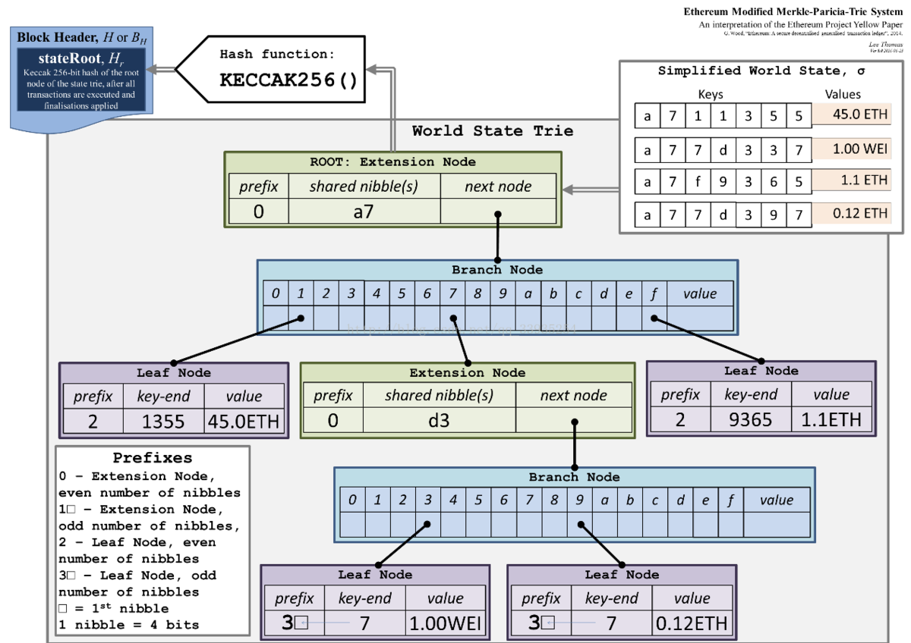
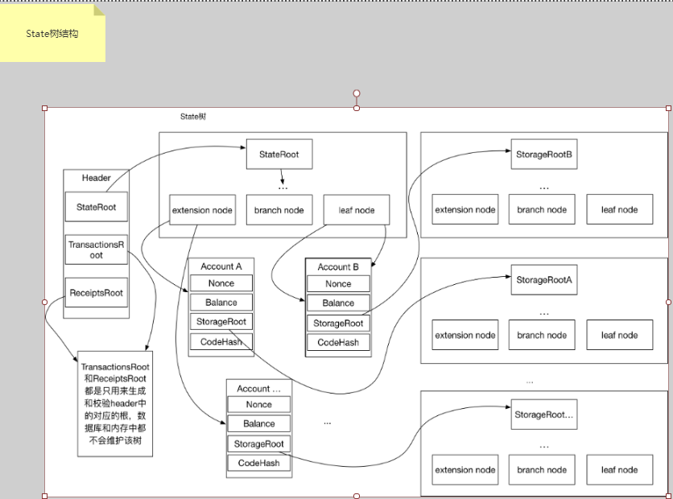
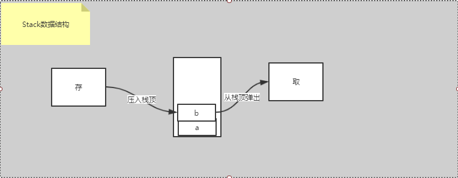
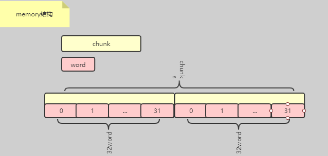

## **定义**
智能合约(Smart Contract)是一种旨在以信息化方式传播、验证或执行合同的计算机协议。智能合约允许在没有第三方的情况下进行可信交易，这些交易可追踪且不可逆转。智能合约概念于1995年由Nick Szabo首次提出
## **介绍**
Native的智能合约基于以太坊EVM模块开发，并对其做了升级优化

## **合约安全规范**

+ Permission

+ KYC
  

在Native链中，我们对参与者都进行了身份认证的抽象，那么在合约中可以支持身份认证的验证，如你可以发行某种债券，但因政策法律的原因，你可能不希望某个国家的用户来购买债券；

  + eq 等于表达式，当表达式为"eq(countries,'AUSTRALIA')" ,KYC:{"countries":"AUSTRALIA"}验证成功；
  + not 不等于表达式 当表达式为"not(countries,'AUSTRALIA')" ,KYC:{"countries":"AUSTRALIA"}验证失败；
  + || 表达式连接符，表示或关系"eq(countries,'AUSTRALIA') || eq(countries,'CHINA')" ,KYC:{"countries":"AUSTRALIA"}验证成功
  + && 表达式连接符，表示且关系多个条件必须满足"eq(countries,'AUSTRALIA') && eq(age,'10')" ,KYC:{"countries":"AUSTRALIA"}验证失败

  ···

  ```
  // 合约定义KYC的countries属性必须为AUSTRALIA，如果userAddress的identity中kyc的countries为AUSTRALIA则验证成功返回true，否则返回false
  string kyc_expression = "eq(countries,'AUSTRALIA')";
  function checkKyc(address userAddress,string kyc) internal returns(bool){
  
          bytes memory input =abi.encode(userAddress,kyc);
          bytes32[1] memory output;
          emit Bytes(input);
          uint inputSize = input.length + 32;
          bytes32 callAddress  = STACS_KEY_ADDR;
          assembly{
              let success := call(
              0,
              callAddress,
              0,
              input,
              inputSize,
              output,
              32)
          }
          emit Bytes32(output[0]);
          if(output[0] == success){
              return true;
          }else{
              return false;
          }
  
      }
  ```

+ 合约调用合约方法参数定义安全规范

  如果合约A中的`sayHello(bool result, uint256 a, uint256 b, address add)`调用合约B`getResult`方法，那么合约B的`getResult`方法的参数列表必须属于合约A
    `sayHello`参数列表子项
  
    `getResult(bool result, uint256 a, uint256 b, address add) #合法`
  
    `getResult(bool result, address add) #合法`
  
    `getResult(uint256 result, address add) #不合法合法`

  实现原理 

  1：获取A合约执行的方法签名，按A合约地址和签名查询Function，将Function的参数列表进行转换str1<bool,uint256,uint256,address>（截取合约执行参数data前4个字节即为方法签名) 

  2：获取B合约执行的方法签名，按B合约地址和签名查询Function，将Function的参数列表进行转换str2<bool>

  3：验证str1是否从开头包含str2,验证通过则符合规范；

+ 合约调用合约参数传值安全规范 

  1.截取外部交易调用执行的参数data(截取第4个字节以后的全部参数)为d1;

  2.截取当前合约执行的参数data(截取第4个字节以后的全部参数)为d2;

  3.判断d1是否从首位开始完全包含d2，如果包含关系不成立，说明调用的B合约未遵守编码规范，内部合约调用失败getResult方法

~~~
#合约A
pragma solidity ^0.4.24;
 interface RemoteContract{
     function getResult(bool result) external returns(bool success);
 }
 contract A{
     function sayHello(bool result, uint256 a, uint256 b, address add) public returns (bool success){
         RemoteContract   remote = RemoteContract(add);
         return remote.getResult(result);
     }
 }
 
 #合约B
 pragma solidity ^0.4.24;
 contract B{
     function getResult(bool result) external returns (bool success)
         return true;
     }
 }
~~~

 + 增强对原始交易发起人的验证，当合约调用合约时通过原始msg.sender验证可能会被攻击

```
pragma solidity ^0.4.24;

contract B{

    event Bytes32(bytes32);

    bytes32 constant STACS_ADDR = bytes32(0x5354414353000000000000000000000000000000000000000000000000000001);
    bytes32 constant MSG_SENDER = bytes32(0x000000000000000000000000000000000000000000004d53475f53454e444552);
    
    function getContextParam(bytes32 input, uint outputSize, bytes32 precompliedContractAddr) internal returns (bytes32){
        bytes32[1] memory inputs;
        inputs[0] = input;
        bytes32 stacs_addr = precompliedContractAddr;
        bytes32[1] memory output;
        assembly{
            let success := call(
            0,
            stacs_addr,
            0,
            inputs,
            32,
            output,
            outputSize)
        }
        return output[0];
    }
    
    function getResult(address originalAddress,bool result)  public returns(bool s)  {
        
        //通过使用增强的预编译合约验证，originalAddress是否是最原始交易的sender
        bytes32 output = getContextParam(MSG_SENDER, 32, STACS_ADDR);
        require(output.length > 0, "output is empty");
        emit Bytes32(output);
        emit Bytes32(bytes32(originalAddress));
        require(bytes32(originalAddress) == output);

        return result;
    }

}
```

```
pragma solidity ^0.4.24;
interface RemoteContract{
    function getResult(address originalAddress, bool result) external returns(bool success);
}
contract A{
   function sayHello(address originalAddress,bool result, uint256 a, uint256 b, address add) public returns (bool success){
             RemoteContract   remote = RemoteContract(add);
       return remote.getResult(originalAddress,true);
   }

   function sayMsg( uint256 a, uint256 b) public returns (bool success){
      return true;
   }

}
```


## **合约实现**

### **MPT** 

MPT（Merkle Patricia Tree），MPT树中的节点包括空节点、叶子节点、扩展节点和分支节点:
空节点，简单的表示空，在代码中是一个空串。叶子节点（leaf），表示为[key,value]的一个键值对，其中key是key的一种特殊十六进制编码，value是value的RLP编码。
扩展节点（extension），也是[key，value]的一个键值对，但是这里的value是其他节点的hash值，这个hash可以被用来查询数据库中的节点。也就是说通过hash链接到其他节点。
分支节点（branch），因为MPT树中的key被编码成一种特殊的16进制的表示，再加上最后的value，所以分支节点是一个长度为17的list，前16个元素对应着key中的16个可能的十六进制字符，如果有一个[key,value]对在这个分支节点终止，最后一个元素代表一个值，即分支节点既可以搜索路径的终止也可以是路径的中间节点。
MPT树中另外一个重要的概念是一个特殊的十六进制前缀(hex-prefix, HP)编码，用来对key进行编码。因为字母表是16进制的，所以每个节点可能有16个孩子。因为有两种[key,value]节点(叶节点和扩展节点)，引进一种特殊的终止符标识来标识key所对应的是值是真实的值，还是其他节点的hash。如果终止符标记被打开，那么key对应的是叶节点，对应的值是真实的value。
如果终止符标记被关闭，那么值就是用于在数据块中查询对应的节点的hash。无论key奇数长度还是偶数长度，HP都可以对其进行编码。最后我们注意到一个单独的hex字符或者4bit二进制数字，即一个nibble。
HP编码很简单。一个nibble被加到key前（下图中的prefix），对终止符的状态和奇偶性进行编码。最低位表示奇偶性，第二低位编码终止符状态。如果key是偶数长度，那么加上另外一个nibble，值为0来保持整体的偶特性。


### **快照(CACHE)**

* 虚拟机执行时会创建三个级别的快照，分别是区块级别的快照，交易级别的快照，合约级别的快照。如果合约执行失败那么合约级别的快照不会提交到它的父快照（即交易快照
，这样就可以不需要再处理交易快照的事务，最终这次合约执行的事务也不会提交到数据库。快照包含了3个缓存：
+ 账户缓存 accountStateCache,key为地址，value为账户，账户包含了
    address：用户地址
    余额：外部账户余额
    nonce：账户发送交易的计数，设计nonce目的是为了防止重放攻击，也是防止一个交易多次被执行
    codeHash:如果该账户是一个合约，则可以codeHash查询部署的合约代码 
    storageRoot：存储状态树根hash
+ 代码缓存 codeCache,key:代码hash+地址，value：部署的合约代码元数据
+ 存储缓存storageCache，key：地址，value：状态Map，该Map分别以合约字段和值为键值对，在合约执行过程中填充和修改
  

  ### **指令(Opcode)**
* 指令由256bit位组成，重要指令功能说明，EVM基于栈的操作，从栈PULL指令并执行，将指令执行的结果再PUSH到栈顶或其他操作
+ mload：花费32gas*数据大小，用途：取出栈顶的元素作为key，从memory中取出该key对应的value，存入initpoll中最新元素，并且把该值压入栈中。
+ mstore：取出栈上的最新的两个数据，一个作为key，一个作为value，写入memory，并且存入initpoll中。initpoll也是一个栈的结构
+ sload：从statedb中取出合约地址下面的某个key对应的value值，存入栈的最新元素里。sload固定是200gas
+ sstore：从栈中取中两个值作为key和value，然后在statedb中存入刚才取出的key和value，并且在initpool中放入该value。
+ pushx：从字节指令代码数据中取出从pc计数器到x个指令出来，压入栈中。x为1到32  
+ dumpx:主要实现的是把栈中的某个位置元素拷贝再压入栈顶，X为1-16；
+ swapx：把栈上的第x个元素和栈顶元素进行交换，x为1-16；
+ logx：根据栈的前两个元素作为key和size，从内存里取出相应的数据，存入statedb的journal（日志）里。1，2，3，4代表的是日志的主题，
一次最多可以存入4个主题，x为1-4；
+ create：Create指令实现的是创建合约，将会调用
+ call：call指令实现的是调用合约，将会调用
+ callcode：callcode指令实现的是一个合约调用其他合约，最终将会调用callcode方法，和call方法最大不同的是执行合约的上下文是调用者，而不是将要执行的合约
+ return：return指令实现的是：从内存中，以栈顶的前两个元素作为偏移量和size，取出相应的数据放入intpool中，并返回数据

### **栈(Stack)**  
+ EVM指令的执行都是基于栈的操作，虚拟机分为两种：基于栈的虚拟机和基于寄存器的虚拟机。基于栈的虚拟机有几个重要的特性：实现简单、可移植，这也
是为什么以太坊选择了基于栈的虚拟机。在基于栈的虚拟机中，有个重要的概念：操作数栈，数据存取为先进先出。所有的操作都是直接与操作数栈直接交互,
例如：取数据、存数据、执行操作等。这样有一个好处：可以无视具体的物理机器架构，特别是寄存器，但是缺点也很明显，速度慢，无论什么操作都需要经过
操作数栈。


### **临时存储模型(Memory)**
+ VM中执行的Memory为临时存储，因为stack每一项限制为32字节，所以当操作大数据时，需要将数据临时存放到memory中，memory底层为byte[]集合，
byte[]长度为1024，装载了32个DataWord(32位byte)，每次扩容都以1024为一个单位进行扩容

